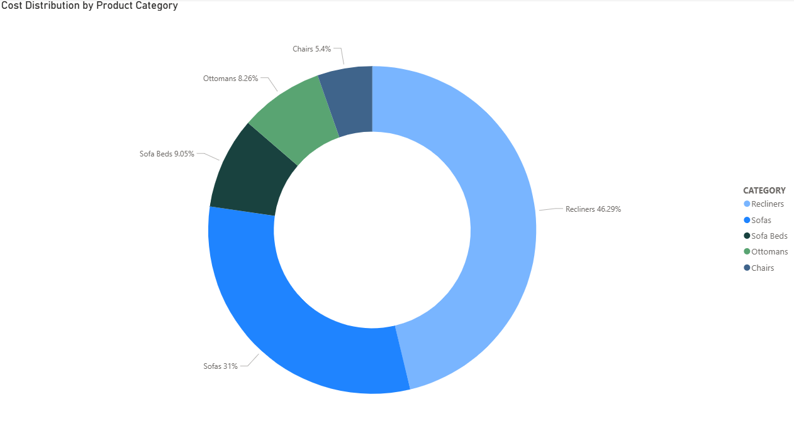
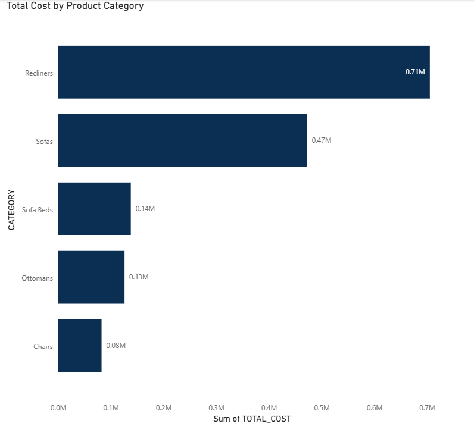
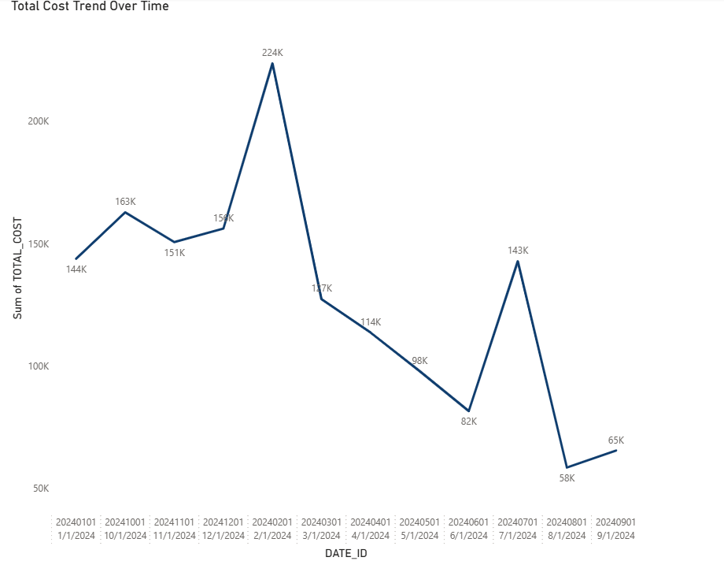
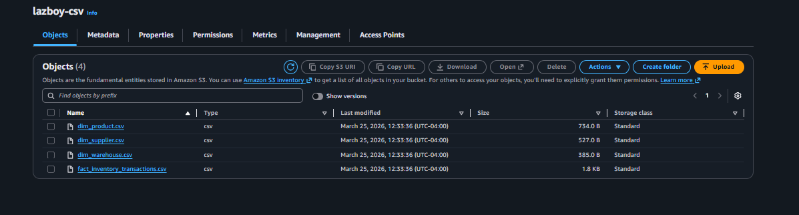

# Supply Chain Analytics Dashboard

## Overview
Built an end to end data pipeline and dashboard to analyze supply chain data including suppliers, products, warehouses, and inventory transactions.

## Architecture
CSV Files → AWS S3 → Fivetran → AWS RDS PostgreSQL → Power BI

## Dashboard Preview

### Cost Distribution by Product Category

### Total Cost by Product Category

### Total Cost Trend Over Time

## Data Source (AWS S3)

## Key Insights
- Most inventory activity is driven by receipts rather than returns  
- Certain suppliers contribute significantly more inventory than others  
- Inventory movement varies by warehouse location  
- Product demand is concentrated in specific warehouses  

## Tools Used
- AWS (S3, RDS PostgreSQL, IAM)  
- Fivetran  
- Power BI  
